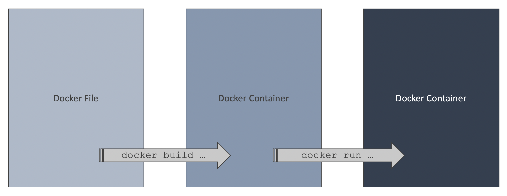
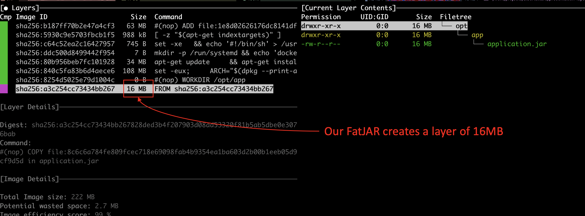
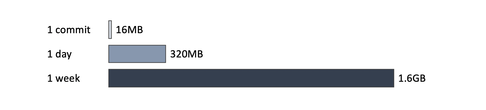
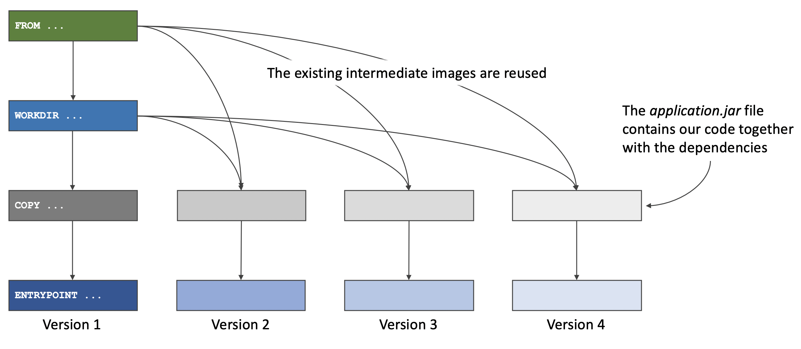
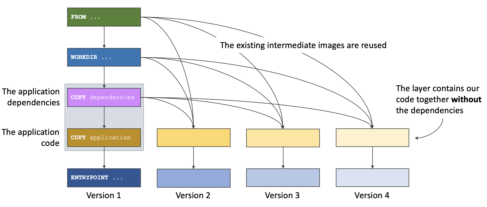
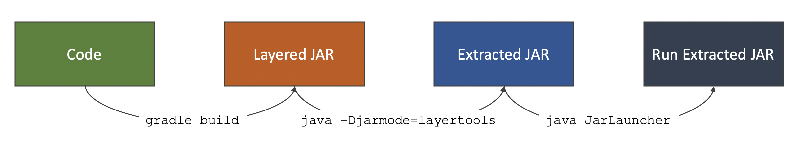
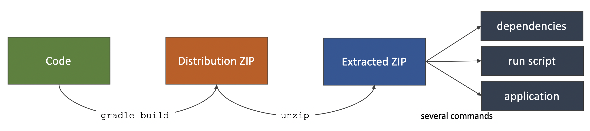
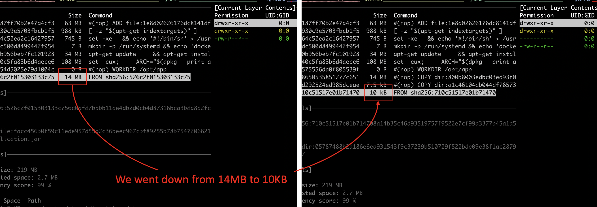

title: Layered JARs
class: animation-fade
layout: true

<!-- This slide will serve as the base layout for all your slides -->
.bottom-bar[
  {{title}}
]
---

class: demand

---

class: impact

# {{title}}
## Optimise your Docker images with Layered JARs

---

class: impact

## By Johanna Lang and Albert Attard

*jlang@thoughtworks.com*
*albert.attard@thoughtworks.com*

---

# Agenda

## Docker
## Layers
## Spring Boot
## Beyond Spring Boot

---

class: impact

# Docker

---

# What is a Docker container?

- A standard deployment unit that encapsulates an application and all its dependencies

.responsive[]

(Not happy with the title, and would like to have something more like _what is docker_ instead)

---

# How to create a Docker container?

- A docker container is created every time we run a _docker image_

  ```bash
  $ docker run --rm \
     --name docker-container-demo \
     -p 8080:8080 \
     spkane/quantum-game:latest
  ```

- We don't have to worry about any specific runtime environment or any particular dependency version as everything is encapsulated in the container

---

.responsive[]

---

# What is a Docker image?

- **read-only** filesystem that contains

  - operating system
  - programs needed by the application (e.g. Java Runtime Environment)
  - application executable, dependencies, and configuration

- immutable (cannot be modified once built)

- new image gets created every time a new version of our application is dockerized
---

# How to create a Docker image?

- by building a _Dockerfile_

  ```bash
  $ docker build . -t boot-fat-jar:local
  ```

  The above command creates a docker image and tags it as `boot-fat-jar:local`

- We can run the docker image (creating a docker container) once this is built

  ```bash
  $ docker run --rm \
     --name boot-fat-jar-demo \
     -p 8080:8080 \
     boot-fat-jar:local
  ```

---

# What is a Dockerfile?

- text file, usually named `Dockerfile`, that contains a set of instructions used to create the Docker image

- Docker promotes reuse and a _Dockerfile_ can extend another image

  - For example, a _Dockerfile_ hosting a Java application can extend another image that already has the Java Runtime installed and only customises the parts that it needs, rather that starting from scratch

---

# Example of a Dockerfile

- Following is a typical _Dockerfile_ that hosts a Java application

  ```dockerfile
  FROM adoptopenjdk:8u252-b09-jre-hotspot-bionic
  WORKDIR /opt/app
  COPY ./build/libs/*.jar application.jar
  ENTRYPOINT ["java", "-jar", "application.jar"]
  ```

- Our example makes use of Java 8, as this is still the most popular version of Java, but will work with any version of Java

---

# Lifecycle

.responsive[]

---

class: impact

# Layers

---

# What are layers?

- Consider the following _Dockerfile_

  ```dockerfile
  FROM adoptopenjdk:8u252-b09-jre-hotspot-bionic
  WORKDIR /opt/app
  COPY ./build/libs/*.jar application.jar
  ENTRYPOINT ["java", "-jar", "application.jar"]
  ```

- The above docker file has four layers
  - `FROM ...`
  - `WORKDIR ...`
  - `COPY ...`
  - `ENTRYPOINT ...`

---

# Intermediate Images

.responsive[]

---

# Demo

- Build a docker image

- Discuss layers and see docker takes advantage of caching

- Analyse the docker image, using `dive`

[▶️ Demo](assets/demo/Demo 1 - Build docker image and analyse layers with dive.mp4)

---

# FatJAR / UberJAR

- A very common way to package a Java application is to create a FatJAR (also known as _UberJAR_)

- A FatJAR contains
  - Our application
  - All dependencies (JARs)

- A FatJAR is standalone and can be executed using `java -jar ...`

  ```bash
  $ java -jar application.jar
  ```

---

# FatJAR and docker image

- Our docker file copies the FatJAR

  ```dockerfile
  COPY ./build/libs/*.jar application.jar
  ```

- This creates a new layer every time a new FatJAR file is created

- Creating many large layers may consume large amounts of disk space

---

# Size of FatJAR

.responsive[]

---

# Space requirements

- Consider a relatively active team working 5 days a week and committing 20 times per day

- Each commit is followed by a push, which triggers an automated build pipeline, which builds the application and creates a new docker image

.responsive[]

(talk about deleting older images is not a trivial task and requires some thought;
they might be needed for rollbacks or legal/auditing purposes)

---

# The challenge

- Our application comprises our code and its dependencies

- When new features are added, the dependencies are not necessarily updated

- One small change in the code, creates a new docker layer of about 16MB in size

---

# The challenge

.responsive[]

(Should we have a quick demo here showing that the first two intermediate layers are cached but the third and the subsequent layers are not?)

---

# Splitting the dependencies

- Instead of using a FatJAR, we can split the dependencies

- We will have more than one docker `COPY` command, with our application copied last

- Changes to our application will simply require a thinner layer to be created

---

# Splitting the dependencies

.responsive[]

---

class: impact

# Spring Boot

---

# Spring Boot

Spring Boot is a very popular framework that promotes productivity

.responsive[]
[https://spring.io/projects/spring-boot](https://spring.io/projects/spring-boot)

---

# Layered JAR

- Spring Boot 2.3 comes with a new feature, _Layered JAR_

- This can be enabled by simply adding a configuration to the Gradle `build.gradle` file

  ```groovy
  bootJar {
      layered()
  }
  ```

  An equivalent plugin is available for Maven too

---

# How does this work?

- Gradle builds our Layered JAR

- Extract the Layered JAR

- Run the Extracted JAR

.responsive[]

---

# Demo

- Build layered JAR

- Extract Layered JAR

- Run Extracted JAR

[▶️ Demo](assets/demo/Demo 2 - Build layered JAR, extract it and run extracted JAR.mp4)
(Still pending!!)

---

# How does this work with docker?

- We can take advantage of multistage docker builds

  ```dockerfile
  FROM adoptopenjdk:8u252-b09-jre-hotspot-bionic as builder
  WORKDIR /opt/app
  COPY ./build/libs/*.jar application.jar
  RUN java -Djarmode=layertools -jar application.jar extract

  FROM adoptopenjdk:8u252-b09-jre-hotspot-bionic
  WORKDIR /opt/app
  COPY --from=builder /opt/app/dependencies ./
  COPY --from=builder /opt/app/spring-boot-loader ./
  COPY --from=builder /opt/app/snapshot-dependencies ./
  COPY --from=builder /opt/app/application ./
  ENTRYPOINT ["java", "org.springframework.boot.loader.JarLauncher"]
  ```

---

# Builder stage

- Copy the layered JAR created by Gradle

  ```Dockerfile
  FROM adoptopenjdk:8u252-b09-jre-hotspot-bionic as builder
  WORKDIR /opt/app
  COPY ./build/libs/*.jar application.jar
  ```

- Extract the layered JAR

  ```Dockerfile
  RUN java -Djarmode=layertools -jar application.jar extract
  ```

  This command will create four folders in the builder stage, which we can copy from in the final stage

---

# Final stage

- Starts with a Java image

  ```Dockerfile
  FROM adoptopenjdk:8u252-b09-jre-hotspot-bionic
  WORKDIR /opt/app
  ```

- Copy the extracted folders from the builder stage

  ```Dockerfile
  COPY --from=builder /opt/app/dependencies ./
  COPY --from=builder /opt/app/spring-boot-loader ./
  COPY --from=builder /opt/app/snapshot-dependencies ./
  COPY --from=builder /opt/app/application ./
  ```

- Use the `JarLauncher`

  ```Dockerfile
  ENTRYPOINT ["java", "org.springframework.boot.loader.JarLauncher"]
  ```

---

# Demo

- Create docker image (using multistage and layered JAR)

- Inspect with Dive

[▶️ Demo](assets/demo/Demo 3 - Create docker image using layered JAR and analyse it with dive.mp4)
(Still pending!!)

---

# Size of Layered JAR

.responsive[]

---

# Comparison

- Comparing these two approaches we will find that a layered JAR is far more efficient than a FatJAR

.responsive[]

---
class: impact

# Beyond Spring Boot

---

# Micronaut

Micronaut is reflection free alternative framework to Spring Boot

.responsive[]
[https://micronaut.io/](https://micronaut.io/)

---

# Lack of tooling

- Spring Boot provides the layered JAR functionality as a Gradle task

- This is not available for all other frameworks

- We can take advantage of the docker multistage to split our dependencies from the application

---

# How will this work?

- Extract the distribution ZIP file<br/>
  _generated by the `distribution` Gradle plugin which is applied by the `application` Gradle plugin_

- Move our application thin JAR to its own directory

- Update the run script

.responsive[]

---

# Multistage to the rescue

```Dockerfile
FROM alpine:3.12.0 as builder
WORKDIR /opt/app
COPY ./build/distributions/*.zip application.zip
RUN unzip application.zip && rm application.zip \
    && mv * dist && rm dist/bin/*.bat && mv dist/bin/* dist/bin/run.original \
    && sed 's|$APP_HOME/lib/application.jar|$APP_HOME/app/application.jar|g' dist/bin/run.original > dist/bin/run \
    && chmod +x dist/bin/run \
    && rm dist/bin/run.original \
    && mkdir dist/app \
    && mv dist/lib/application.jar dist/app/application.jar

FROM adoptopenjdk:8u252-b09-jre-hotspot-bionic
ENV APP_HOME /opt/app
WORKDIR ${APP_HOME}
COPY --from=builder /opt/app/dist/lib lib/
COPY --from=builder /opt/app/dist/bin bin/
COPY --from=builder /opt/app/dist/app app/
ENTRYPOINT ["./bin/run"]
```

---

# Demo

- Go through the `micronaut-layered-jar-1.0.zip` file

- Go through the multistage docker file

- Create docker image (using multistage)

- Inspect with Dive

[▶️ Demo](assets/demo/Demo 4 - Create docker image using distribution ZIP and analyse it with dive.mp4)
(Still pending!!)

---

# Comparison

.responsive[]

---

class: impact

# Thank You
## Feedback makes us better

Please send any feedback to: albert.attard@thoughtworks.com or jlang@thoughtworks.com

---

class: careers
