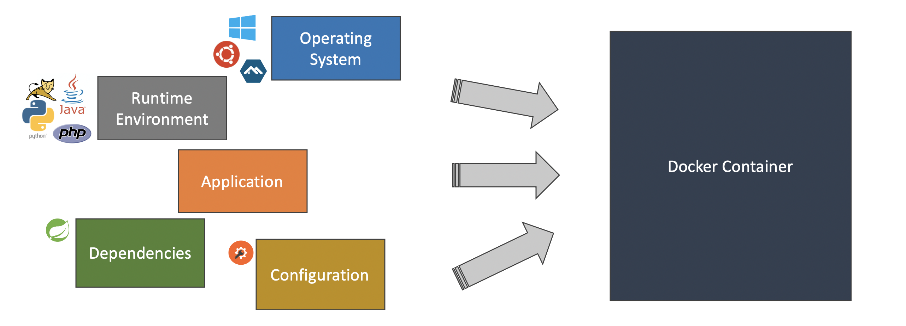

title: Layered JARs
class: animation-fade
layout: true

<!-- This slide will serve as the base layout for all your slides -->
.bottom-bar[
  {{title}}
]
---

class: demand

---

class: impact

# {{title}}
## Optimise your Docker images with Layered JARs

---

class: impact

## By Johanna Lang and Albert Attard

*jlang@thoughtworks.com*
*albert.attard@thoughtworks.com*

---

# Agenda

## Docker
## Layers
## Fat JAR
## Layered JAR
## Beyond Spring Boot

---

class: impact

# Docker

---

# What is a container?

- A standard deployment unit that encapsulates an application all its dependencies

.center[]

(Not happy with the title, and would like to have something more like _what is docker_ instead)

---

# How do create a docker container?

- A docker container is created every time we run a _docker image_

  ```bash
  $ docker run --rm \
     --name docker-container-demo \
     -p 8080:8080 \
     spkane/quantum-game:latest
  ```

- We don't have to worry about any specific runtime environment or any particular dependency version as everything is encapsulated in the container

---

# Playing a game

.center[]

---

# What is a docker image?

- A docker image is a file-system that contains

  - The operating system
  - The programs needed by the application, such as the Java Runtime Environment
  - The application executable, dependencies, and configuration
---

# How do create a docker image?

- A docker image is created by building a _dockerfile_

  ```bash
  $ docker build ./boot-fat-jar -t boot-fat-jar:local
  ```

- We can run the docker image (creating a docker container) once this is built

  ```bash
  $ docker run --rm \
     --name boot-fat-jar-demo \
     -p 8080:8080 \
     boot-fat-jar:local
  ```

---

# What is a Dockerfile?
- script, composed of various commands (instructions)
- automatically perform actions on a base image in order to create a new one
- each instruction is a read-only layer
(add example dockerfile)

---

class: impact

# Layers
(Is this about layers in a Dockerfile?)
---

class: impact

# Fat JAR
- approach to packaging an application
- includes everything needed to run an app on a standard Java Runtime environment:
1) dependencies
2) resources
3) code

---

class: impact

# Layered JAR

---

class: impact

# Beyond Spring Boot

---

# Something else

```dockerfile
FROM adoptopenjdk:8u252-b09-jre-hotspot-bionic as builder
WORKDIR /opt/app
COPY ./build/libs/*.jar application.jar
RUN java -Djarmode=layertools -jar application.jar extract

FROM adoptopenjdk:8u252-b09-jre-hotspot-bionic
WORKDIR /opt/app
COPY --from=builder /opt/app/dependencies ./
COPY --from=builder /opt/app/spring-boot-loader ./
COPY --from=builder /opt/app/snapshot-dependencies ./
COPY --from=builder /opt/app/application ./
ENTRYPOINT ["java", "org.springframework.boot.loader.JarLauncher"]
```

---

class: impact

# Thank You
## Feedback makes us better

Please send any feedback to: albert.attard@thoughtworks.com or jlang@thoughtworks.com

---

class: careers


