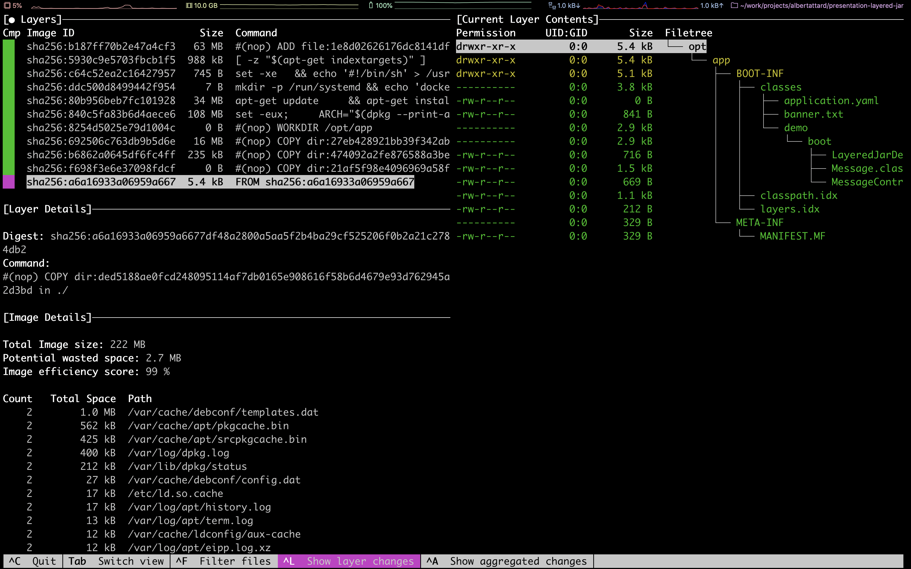
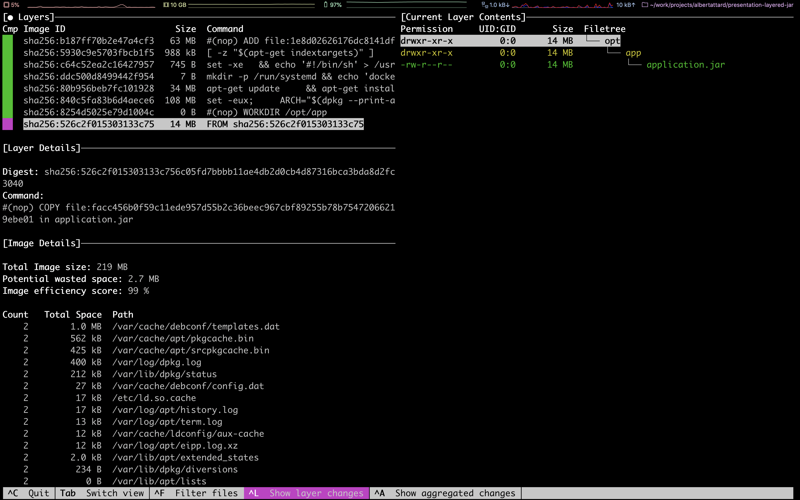

# Layered JAR

**Requirements**

1. [Java 8](https://openjdk.java.net/projects/jdk8/) or above
1. [Docker](https://www.docker.com/)

Java 8 is used in this demo as this is the most popular version of Java followed by [Java 11]( https://openjdk.java.net/projects/jdk/11/) ([reference](https://www.jrebel.com/blog/2020-java-technology-report)).


This demo can work with newer version of Java too.

## Examples

1. [Spring Boot Fat JAR](#spring-boot-fat-jar)
1. [Spring Boot Layered JAR](#spring-boot-layered-jar)

### Spring Boot Fat JAR

   ```bash
   $ ./gradlew boot-fat-jar:clean boot-fat-jar:build

   ...

   BUILD SUCCESSFUL in 7s
   6 actionable tasks: 6 executed
   ```

1. Build the docker image

   ```bash
   $ docker build ./boot-fat-jar -t boot-fat-jar:local

   Sending build context to Docker daemon  16.64MB
   Step 1/4 : FROM adoptopenjdk:8u252-b09-jre-hotspot-bionic as builder
    ---> 23c63e57953e
   Step 2/4 : WORKDIR /opt/app
    ---> Using cache
    ---> 2430694de82b
   Step 3/4 : COPY ./build/libs/*.jar application.jar
    ---> fccbe65b7fdd
   Step 4/4 : ENTRYPOINT ["java", "-jar", "application.jar"]
    ---> Running in dfbcb884cf38
   Removing intermediate container dfbcb884cf38
    ---> 408024fb4697
   Successfully built 408024fb4697
   Successfully tagged boot-fat-jar:local
   ```

1. Analyse the image

   ```bash
   $ dive boot-fat-jar:local
   ```

   

1. Run docker images

   ```bash
   $ docker run -it -p 8080:8080 boot-fat-jar:local
   ```

   Access the application

   ```bash
   $ curl "http://localhost:8080/"
   ```

   This should reply a message like the following one

   ```json
   {"message":"Layered JARS are great!!"}
   ```

### Spring Boot Layered JAR

1. Build the project

   ```bash
   $ ./gradlew boot-layered-jar:clean boot-layered-jar:build

   ...

   BUILD SUCCESSFUL in 7s
   6 actionable tasks: 6 executed
   ```

1. Build the docker image

   ```bash
   $ docker build ./boot-layered-jar -t boot-layered-jar:local

   Sending build context to Docker daemon  16.67MB
   Step 1/11 : FROM adoptopenjdk:8u252-b09-jre-hotspot-bionic as builder
    ---> 23c63e57953e
   Step 2/11 : WORKDIR /opt/app
    ---> Using cache
    ---> 2430694de82b
   Step 3/11 : COPY ./build/libs/*.jar application.jar
    ---> Using cache
    ---> 16342225325a
   Step 4/11 : RUN java -Djarmode=layertools -jar application.jar extract
    ---> Using cache
    ---> 92601680dc50
   Step 5/11 : FROM adoptopenjdk:8u252-b09-jre-hotspot-bionic
    ---> 23c63e57953e
   Step 6/11 : WORKDIR /opt/app
    ---> Using cache
    ---> 2430694de82b
   Step 7/11 : COPY --from=builder /opt/app/dependencies ./
    ---> Using cache
    ---> e0d5a2e15e6b
   Step 8/11 : COPY --from=builder /opt/app/spring-boot-loader ./
    ---> Using cache
    ---> ad8f98183af5
   Step 9/11 : COPY --from=builder /opt/app/snapshot-dependencies ./
    ---> Using cache
    ---> 657629cb8c7d
   Step 10/11 : COPY --from=builder /opt/app/application ./
    ---> Using cache
    ---> 3e4d7bc3ba71
   Step 11/11 : ENTRYPOINT ["java", "org.springframework.boot.loader.JarLauncher"]
    ---> Using cache
    ---> 95535bc1c898
   Successfully built 95535bc1c898
   Successfully tagged boot-layered-jar:local
   ```

1. Analyse the image

   ```bash
   $ dive boot-layered-jar:local
   ```

   

1. Run docker images

   ```bash
   $ docker run -it -p 8080:8080 boot-layered-jar:local
   ```

   Access the application

   ```bash
   $ curl "http://localhost:8080/"
   ```

   This should reply a message like the following one

   ```json
   {"message":"Layered JARS are great!!"}
   ```

## Micronaut Fat JAR

1. Build the project

   ```bash
   $ ./gradlew micronaut-fat-jar:clean micronaut-fat-jar:build

   ...

   BUILD SUCCESSFUL in 7s
   6 actionable tasks: 6 executed
   ```

1. Build the docker image

   ```bash
   $ docker build ./micronaut-fat-jar -t micronaut-fat-jar:local

   Sending build context to Docker daemon  65.07MB
   Step 1/4 : FROM adoptopenjdk:8u252-b09-jre-hotspot-bionic
    ---> 23c63e57953e
   Step 2/4 : WORKDIR /opt/app
    ---> Using cache
    ---> 2430694de82b
   Step 3/4 : COPY ./build/libs/*-all.jar application.jar
    ---> 14e1a294d98f
   Step 4/4 : ENTRYPOINT ["java", "-jar", "application.jar"]
    ---> Running in 596a764c997d
   Removing intermediate container 596a764c997d
    ---> 04f7dcc72a16
   Successfully built 04f7dcc72a16
   Successfully tagged micronaut-fat-jar:local
   ```

1. Analyse the image

   ```bash
   $ dive micronaut-fat-jar:local
   ```

   

1. Run docker images

   ```bash
   $ docker run -it -p 8080:8080 micronaut-fat-jar:local
   ```

   Access the application

   ```bash
   $ curl "http://localhost:8080/"
   ```

   This should reply a message like the following one

   ```json
   {"message":"Layered JARS are great!!"}
   ```

## Micronaut Layered JAR

1. Build the project

   ```bash
   $ ./gradlew micronaut-layered-jar:clean micronaut-layered-jar:build

   ...

   BUILD SUCCESSFUL in 7s
   6 actionable tasks: 6 executed
   ```

1. Build the docker image

   ```bash
   $ docker build ./micronaut-layered-jar -t micronaut-layered-jar:local

   Sending build context to Docker daemon  26.02MB
   Step 1/11 : FROM alpine:3.12.0 as builder
    ---> a24bb4013296
   Step 2/11 : WORKDIR /opt/app
    ---> Using cache
    ---> 3997c4c571b0
   Step 3/11 : COPY ./build/distributions/*.zip application.zip
    ---> 887f07d0a478
   Step 4/11 : RUN unzip application.zip     && rm application.zip     && mv * dist     && rm dist/bin/*.bat     && mv dist/bin/* dist/bin/run.original     && sed 's|$APP_HOME/lib/application.jar|$APP_HOME/app/application.jar|g' dist/bin/run.original > dist/bin/run     && chmod +x dist/bin/run     && rm dist/bin/run.original     && mkdir dist/app     && mv dist/lib/application.jar dist/app/application.jar
    ---> Running in a76eedcc51a4
   Archive:  application.zip
      creating: micronaut-layered-jar-1.0/
      creating: micronaut-layered-jar-1.0/lib/
     inflating: micronaut-layered-jar-1.0/lib/application.jar
     inflating: micronaut-layered-jar-1.0/lib/micronaut-http-client-2.0.0.jar
     inflating: micronaut-layered-jar-1.0/lib/micronaut-http-client-core-2.0.0.jar
     inflating: micronaut-layered-jar-1.0/lib/micronaut-http-server-netty-2.0.0.jar
     inflating: micronaut-layered-jar-1.0/lib/micronaut-http-server-2.0.0.jar
     inflating: micronaut-layered-jar-1.0/lib/micronaut-runtime-2.0.0.jar
     inflating: micronaut-layered-jar-1.0/lib/micronaut-validation-2.0.0.jar
     inflating: micronaut-layered-jar-1.0/lib/micronaut-http-netty-2.0.0.jar
     inflating: micronaut-layered-jar-1.0/lib/micronaut-websocket-2.0.0.jar
     inflating: micronaut-layered-jar-1.0/lib/micronaut-router-2.0.0.jar
     inflating: micronaut-layered-jar-1.0/lib/micronaut-http-2.0.0.jar
     inflating: micronaut-layered-jar-1.0/lib/micronaut-aop-2.0.0.jar
     inflating: micronaut-layered-jar-1.0/lib/micronaut-buffer-netty-2.0.0.jar
     inflating: micronaut-layered-jar-1.0/lib/micronaut-inject-2.0.0.jar
     inflating: micronaut-layered-jar-1.0/lib/logback-classic-1.2.3.jar
     inflating: micronaut-layered-jar-1.0/lib/netty-handler-proxy-4.1.48.Final.jar
     inflating: micronaut-layered-jar-1.0/lib/netty-codec-http2-4.1.48.Final.jar
     inflating: micronaut-layered-jar-1.0/lib/netty-codec-http-4.1.48.Final.jar
     inflating: micronaut-layered-jar-1.0/lib/netty-handler-4.1.48.Final.jar
     inflating: micronaut-layered-jar-1.0/lib/netty-codec-socks-4.1.48.Final.jar
     inflating: micronaut-layered-jar-1.0/lib/netty-codec-4.1.48.Final.jar
     inflating: micronaut-layered-jar-1.0/lib/netty-transport-4.1.48.Final.jar
     inflating: micronaut-layered-jar-1.0/lib/netty-buffer-4.1.48.Final.jar
     inflating: micronaut-layered-jar-1.0/lib/netty-resolver-4.1.48.Final.jar
     inflating: micronaut-layered-jar-1.0/lib/netty-common-4.1.48.Final.jar
     inflating: micronaut-layered-jar-1.0/lib/jackson-datatype-jdk8-2.11.0.jar
     inflating: micronaut-layered-jar-1.0/lib/jackson-datatype-jsr310-2.11.0.jar
     inflating: micronaut-layered-jar-1.0/lib/jackson-databind-2.11.0.jar
     inflating: micronaut-layered-jar-1.0/lib/jackson-annotations-2.11.0.jar
     inflating: micronaut-layered-jar-1.0/lib/jackson-core-2.11.0.jar
     inflating: micronaut-layered-jar-1.0/lib/micronaut-core-2.0.0.jar
     inflating: micronaut-layered-jar-1.0/lib/javax.annotation-api-1.3.2.jar
     inflating: micronaut-layered-jar-1.0/lib/spotbugs-annotations-4.0.3.jar
     inflating: micronaut-layered-jar-1.0/lib/jsr305-3.0.2.jar
     inflating: micronaut-layered-jar-1.0/lib/snakeyaml-1.26.jar
     inflating: micronaut-layered-jar-1.0/lib/slf4j-api-1.7.26.jar
     inflating: micronaut-layered-jar-1.0/lib/rxjava-2.2.10.jar
     inflating: micronaut-layered-jar-1.0/lib/reactive-streams-1.0.3.jar
     inflating: micronaut-layered-jar-1.0/lib/validation-api-2.0.1.Final.jar
     inflating: micronaut-layered-jar-1.0/lib/logback-core-1.2.3.jar
     inflating: micronaut-layered-jar-1.0/lib/javax.inject-1.jar
      creating: micronaut-layered-jar-1.0/bin/
     inflating: micronaut-layered-jar-1.0/bin/micronaut-layered-jar
     inflating: micronaut-layered-jar-1.0/bin/micronaut-layered-jar.bat
   Removing intermediate container a76eedcc51a4
    ---> c082d146cff8
   Step 5/11 : FROM adoptopenjdk:8u252-b09-jre-hotspot-bionic
    ---> 23c63e57953e
   Step 6/11 : ENV APP_HOME /opt/app
    ---> Using cache
    ---> 92ba786da30d
   Step 7/11 : WORKDIR ${APP_HOME}
    ---> Using cache
    ---> 9cd50d4ea27a
   Step 8/11 : COPY --from=builder /opt/app/dist/lib lib/
    ---> Using cache
    ---> b4b8a86166c0
   Step 9/11 : COPY --from=builder /opt/app/dist/bin bin/
    ---> Using cache
    ---> 591f5088c353
   Step 10/11 : COPY --from=builder /opt/app/dist/app app/
    ---> be5fddb75a8b
   Step 11/11 : ENTRYPOINT ["./bin/run"]
    ---> Running in 6a44a615929e
   Removing intermediate container 6a44a615929e
    ---> 68aea52af601
   Successfully built 68aea52af601
   Successfully tagged micronaut-layered-jar:local
   ```

1. Analyse the image

   ```bash
   $ dive micronaut-layered-jar:local
   ```

   

1. Run docker images

   ```bash
   $ docker run -it -p 8080:8080 micronaut-layered-jar:local
   ```

   Access the application

   ```bash
   $ curl "http://localhost:8080/"
   ```

   This should reply a message like the following one

   ```json
   {"message":"Layered JARS are great!!"}
   ```

## Other technologies

1. [Google JIB](https://github.com/GoogleContainerTools/jib)
1. [Buildpacks](https://docs.cloudfoundry.org/buildpacks/)
