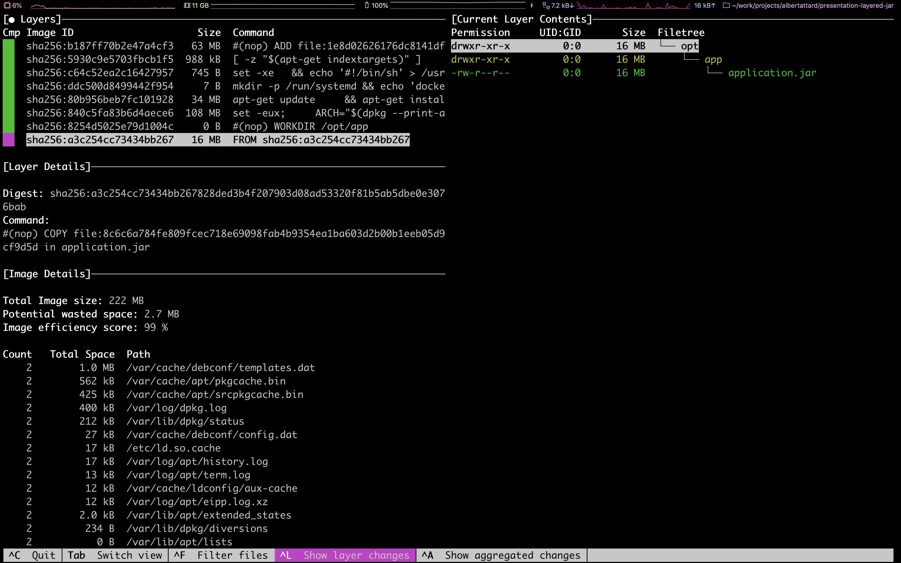

# Demo 2

Build Docker image and analyse layers with dive

1. Build the project

   ```bash
   $ ./gradlew boot-fat-jar:clean boot-fat-jar:build
   ```

1. Navigate to the project directory

   ```bash
   $ cd boot-fat-jar
   ```

1. Analyse the `Dockerfile`

   ```bash
   $ vi Dockerfile
   ```

   The `Dockerfile` contains the following instructions

   ```dockerfile
   FROM adoptopenjdk:8u262-b10-jre-hotspot
   WORKDIR /opt/app
   COPY ./build/libs/*.jar application.jar
   ENTRYPOINT ["java", "-jar", "application.jar"]
   ```

   1. Extends from an existing Java image

      ```dockerfile
      FROM adoptopenjdk:8u262-b10-jre-hotspot
      ```

   1. Creates a directory where the application will be copied to

      ```dockerfile
      WORKDIR /opt/app
      ```

      The application will be started from this directory

   1. Copy the FatJAR file from the laptop to the Docker image

      ```dockerfile
      COPY ./build/libs/*.jar application.jar
      ```

   1. Set the command that will be executed when the Docker container starts

      ```dockerfile
      ENTRYPOINT ["java", "-jar", "application.jar"]
      ```

1. Build the Docker image for the first time

   ```bash
   $ docker build . -t boot-fat-jar:local
   ```

   Docker will download Java image and build the other three layers

   ```bash
   Sending build context to Docker daemon  16.67MB
   Step 1/4 : FROM adoptopenjdk:8u262-b10-jre-hotspot
   8u262-b10-jre-hotspot: Pulling from library/adoptopenjdk
   7595c8c21622: Pull complete
   d13af8ca898f: Pull complete
   70799171ddba: Pull complete
   b6c12202c5ef: Pull complete
   c54d424eaa66: Pull complete
   98cd7f0d1fb1: Pull complete
   Digest: sha256:b67ebc62294088655d44c826eaa174929b02e872b26ac7aa8c8c5cac2b7f2984
   Status: Downloaded newer image for adoptopenjdk:8u262-b10-jre-hotspot
    ---> ded5c12b644e
   Step 2/4 : WORKDIR /opt/app
    ---> Running in 193761ef24a2
   Removing intermediate container 193761ef24a2
    ---> 972d16d55f0f
   Step 3/4 : COPY ./build/libs/*.jar application.jar
    ---> 8004c126ff74
   Step 4/4 : ENTRYPOINT ["java", "-jar", "application.jar"]
    ---> Running in 2b6ed3f51acf
   Removing intermediate container 2b6ed3f51acf
    ---> c1ccaba9be5e
   Successfully built c1ccaba9be5e
   Successfully tagged boot-fat-jar:local
   ```

1. Building the Docker image again, without changing anything

   ```bash
   $ docker build . -t boot-fat-jar:local
   ```

   This time the build will go very quickly as Docker takes advantage of cache

   ```bash
   Sending build context to Docker daemon  16.67MB
   Step 1/4 : FROM adoptopenjdk:8u262-b10-jre-hotspot
    ---> ded5c12b644e
   Step 2/4 : WORKDIR /opt/app
    ---> Using cache
    ---> 972d16d55f0f
   Step 3/4 : COPY ./build/libs/*.jar application.jar
    ---> Using cache
    ---> 8004c126ff74
   Step 4/4 : ENTRYPOINT ["java", "-jar", "application.jar"]
    ---> Using cache
    ---> c1ccaba9be5e
   Successfully built c1ccaba9be5e
   Successfully tagged boot-fat-jar:local
   ```

1. Investigate the Docker image using `dive`

   ```bash
   $ dive boot-fat-jar:local
   ```

   
