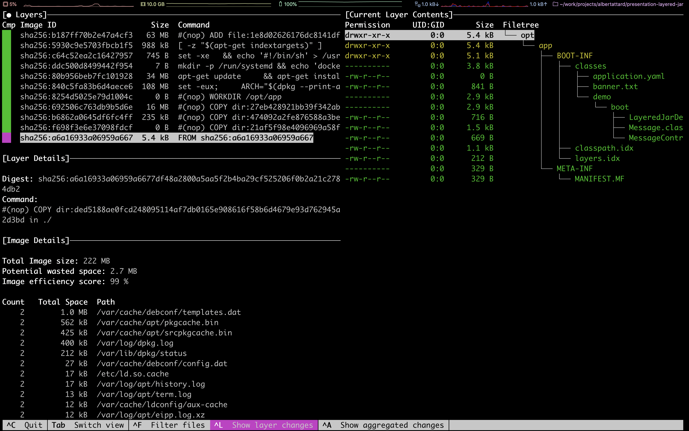
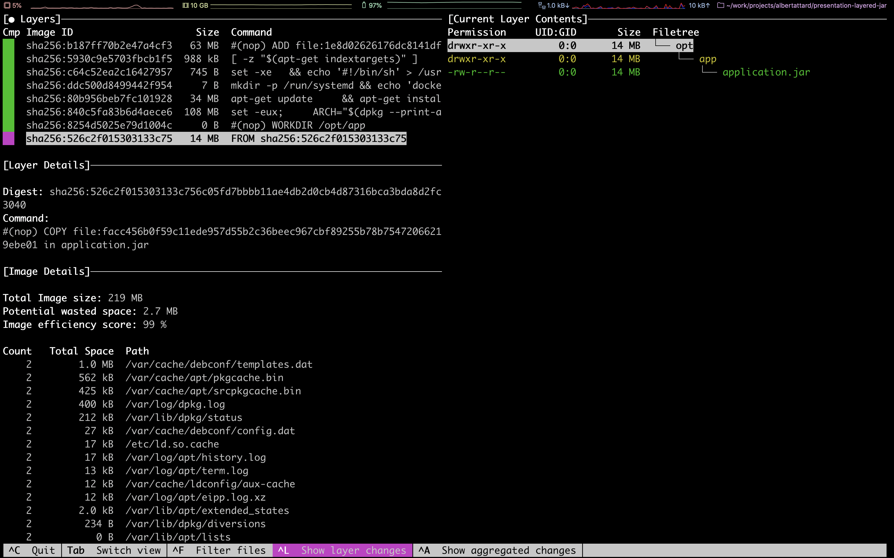
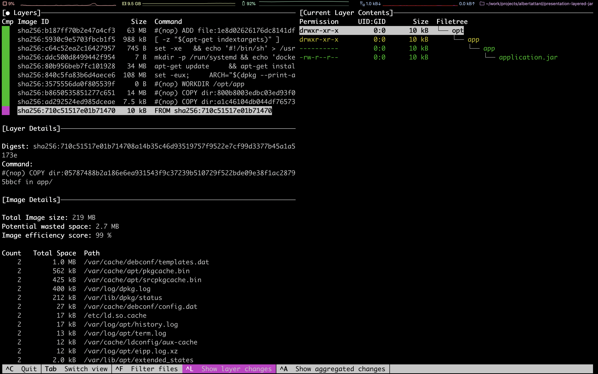
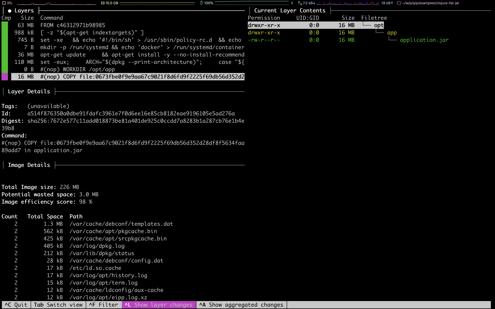
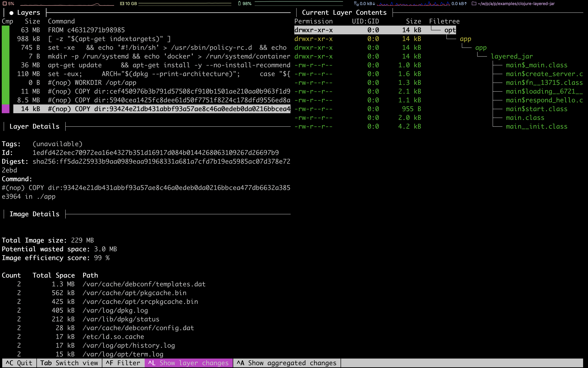

# Layered JAR Examples

**Requirements**

1. [Java 8](https://openjdk.java.net/projects/jdk8/) or above
1. [Docker](https://www.docker.com/)

Java 8 is used in this presentation as this is the most popular version of Java followed by [Java 11]( https://openjdk.java.net/projects/jdk/11/) ([reference](https://www.jrebel.com/blog/2020-java-technology-report)) to date.


These examples can work with newer versions of Java too.

## Examples

There are four examples in total, two with Spring boot and two with Micronaut

1. [Spring Boot Fat JAR](#spring-boot-fat-jar)
1. [Spring Boot Layered JAR](#spring-boot-layered-jar)
1. [Micronaut Fat JAR](#micronaut-fat-jar)
1. [Micronaut Layered JAR](#micronaut-layered-jar)
1. [Clojure Fat JAR](#clojure-fat-jar)

### Spring Boot Fat JAR

1. Go to example

   ```bash
   $ cd boot-fat-jar
   ```

1. Build the application

   ```bash
   $ ./gradlew clean build

   ...

   BUILD SUCCESSFUL in 7s
   6 actionable tasks: 6 executed
   ```

1. Build the docker image

   ```bash
   $ docker build . -t boot-fat-jar:local

   Sending build context to Docker daemon  16.64MB
   Step 1/4 : FROM adoptopenjdk:8u252-b09-jre-hotspot-bionic as builder
    ---> 23c63e57953e
   Step 2/4 : WORKDIR /opt/app
    ---> Using cache
    ---> 2430694de82b
   Step 3/4 : COPY ./build/libs/*.jar application.jar
    ---> fccbe65b7fdd
   Step 4/4 : ENTRYPOINT ["java", "-jar", "application.jar"]
    ---> Running in dfbcb884cf38
   Removing intermediate container dfbcb884cf38
    ---> 408024fb4697
   Successfully built 408024fb4697
   Successfully tagged boot-fat-jar:local
   ```

1. Analyse the image

   ```bash
   $ dive boot-fat-jar:local
   ```

   

1. Run docker images

   ```bash
   $ docker run -it --rm -p 8080:8080 --name boot-fat-jar boot-fat-jar:local
   ```

   Access the application

   ```bash
   $ curl "http://localhost:8080/"
   ```

   This should reply a message like the following one

   ```json
   {"message":"Layered JARS are great!!"}
   ```

### Spring Boot Layered JAR

1. Go to example

   ```bash
   $ cd boot-layered-jar
   ```

1. Build the application

   ```bash
   $ ./gradlew clean build

   ...

   BUILD SUCCESSFUL in 7s
   6 actionable tasks: 6 executed
   ```

1. Build the docker image

   ```bash
   $ docker build . -t boot-layered-jar:local

   Sending build context to Docker daemon  16.67MB
   Step 1/11 : FROM adoptopenjdk:8u252-b09-jre-hotspot-bionic as builder
    ---> 23c63e57953e
   Step 2/11 : WORKDIR /opt/app
    ---> Using cache
    ---> 2430694de82b
   Step 3/11 : COPY ./build/libs/*.jar application.jar
    ---> Using cache
    ---> 16342225325a
   Step 4/11 : RUN java -Djarmode=layertools -jar application.jar extract
    ---> Using cache
    ---> 92601680dc50
   Step 5/11 : FROM adoptopenjdk:8u252-b09-jre-hotspot-bionic
    ---> 23c63e57953e
   Step 6/11 : WORKDIR /opt/app
    ---> Using cache
    ---> 2430694de82b
   Step 7/11 : COPY --from=builder /opt/app/dependencies ./
    ---> Using cache
    ---> e0d5a2e15e6b
   Step 8/11 : COPY --from=builder /opt/app/spring-boot-loader ./
    ---> Using cache
    ---> ad8f98183af5
   Step 9/11 : COPY --from=builder /opt/app/snapshot-dependencies ./
    ---> Using cache
    ---> 657629cb8c7d
   Step 10/11 : COPY --from=builder /opt/app/application ./
    ---> Using cache
    ---> 3e4d7bc3ba71
   Step 11/11 : ENTRYPOINT ["java", "org.springframework.boot.loader.JarLauncher"]
    ---> Using cache
    ---> 95535bc1c898
   Successfully built 95535bc1c898
   Successfully tagged boot-layered-jar:local
   ```

1. Analyse the image

   ```bash
   $ dive boot-layered-jar:local
   ```

   

1. Run docker images

   ```bash
   $ docker run -it --rm -p 8080:8080 --name boot-layered-jar boot-layered-jar:local
   ```

   Access the application

   ```bash
   $ curl "http://localhost:8080/"
   ```

   This should reply a message like the following one

   ```json
   {"message":"Layered JARS are great!!"}
   ```

### Micronaut Fat JAR

1. Go to example

   ```bash
   $ cd micronaut-fat-jar
   ```

1. Build the application

   ```bash
   $ ./gradlew clean build

   ...

   BUILD SUCCESSFUL in 7s
   6 actionable tasks: 6 executed
   ```

1. Build the docker image

   ```bash
   $ docker build . -t micronaut-fat-jar:local

   Sending build context to Docker daemon  65.07MB
   Step 1/4 : FROM adoptopenjdk:8u252-b09-jre-hotspot-bionic
    ---> 23c63e57953e
   Step 2/4 : WORKDIR /opt/app
    ---> Using cache
    ---> 2430694de82b
   Step 3/4 : COPY ./build/libs/*-all.jar application.jar
    ---> 14e1a294d98f
   Step 4/4 : ENTRYPOINT ["java", "-jar", "application.jar"]
    ---> Running in 596a764c997d
   Removing intermediate container 596a764c997d
    ---> 04f7dcc72a16
   Successfully built 04f7dcc72a16
   Successfully tagged micronaut-fat-jar:local
   ```

1. Analyse the image

   ```bash
   $ dive micronaut-fat-jar:local
   ```

   

1. Run docker images

   ```bash
   $ docker run -it --rm -p 8080:8080 --name micronaut-fat-jar micronaut-fat-jar:local
   ```

   Access the application

   ```bash
   $ curl "http://localhost:8080/"
   ```

   This should reply a message like the following one

   ```json
   {"message":"Layered JARS are great!!"}
   ```

### Micronaut Layered JAR

1. Go to example

   ```bash
   $ cd micronaut-layered-jar
   ```

1. Build the application

   ```bash
   $ ./gradlew clean build

   ...

   BUILD SUCCESSFUL in 7s
   6 actionable tasks: 6 executed
   ```

1. Build the docker image

   ```bash
   $ docker build . -t micronaut-layered-jar:local

   Sending build context to Docker daemon  26.02MB
   Step 1/11 : FROM alpine:3.12.0 as builder
    ---> a24bb4013296
   Step 2/11 : WORKDIR /opt/app
    ---> Using cache
    ---> 3997c4c571b0
   Step 3/11 : COPY ./build/distributions/*.zip application.zip
    ---> 887f07d0a478
   Step 4/11 : RUN unzip application.zip     && rm application.zip     && mv * dist     && rm dist/bin/*.bat     && mv dist/bin/* dist/bin/run.original     && sed 's|$APP_HOME/lib/application.jar|$APP_HOME/app/application.jar|g' dist/bin/run.original > dist/bin/run     && chmod +x dist/bin/run     && rm dist/bin/run.original     && mkdir dist/app     && mv dist/lib/application.jar dist/app/application.jar
    ---> Running in a76eedcc51a4
   Archive:  application.zip
      creating: micronaut-layered-jar-1.0/
      creating: micronaut-layered-jar-1.0/lib/
     inflating: micronaut-layered-jar-1.0/lib/application.jar
     inflating: micronaut-layered-jar-1.0/lib/micronaut-http-client-2.0.0.jar
     inflating: micronaut-layered-jar-1.0/lib/micronaut-http-client-core-2.0.0.jar
     inflating: micronaut-layered-jar-1.0/lib/micronaut-http-server-netty-2.0.0.jar
     inflating: micronaut-layered-jar-1.0/lib/micronaut-http-server-2.0.0.jar
     inflating: micronaut-layered-jar-1.0/lib/micronaut-runtime-2.0.0.jar
     inflating: micronaut-layered-jar-1.0/lib/micronaut-validation-2.0.0.jar
     inflating: micronaut-layered-jar-1.0/lib/micronaut-http-netty-2.0.0.jar
     inflating: micronaut-layered-jar-1.0/lib/micronaut-websocket-2.0.0.jar
     inflating: micronaut-layered-jar-1.0/lib/micronaut-router-2.0.0.jar
     inflating: micronaut-layered-jar-1.0/lib/micronaut-http-2.0.0.jar
     inflating: micronaut-layered-jar-1.0/lib/micronaut-aop-2.0.0.jar
     inflating: micronaut-layered-jar-1.0/lib/micronaut-buffer-netty-2.0.0.jar
     inflating: micronaut-layered-jar-1.0/lib/micronaut-inject-2.0.0.jar
     inflating: micronaut-layered-jar-1.0/lib/logback-classic-1.2.3.jar
     inflating: micronaut-layered-jar-1.0/lib/netty-handler-proxy-4.1.48.Final.jar
     inflating: micronaut-layered-jar-1.0/lib/netty-codec-http2-4.1.48.Final.jar
     inflating: micronaut-layered-jar-1.0/lib/netty-codec-http-4.1.48.Final.jar
     inflating: micronaut-layered-jar-1.0/lib/netty-handler-4.1.48.Final.jar
     inflating: micronaut-layered-jar-1.0/lib/netty-codec-socks-4.1.48.Final.jar
     inflating: micronaut-layered-jar-1.0/lib/netty-codec-4.1.48.Final.jar
     inflating: micronaut-layered-jar-1.0/lib/netty-transport-4.1.48.Final.jar
     inflating: micronaut-layered-jar-1.0/lib/netty-buffer-4.1.48.Final.jar
     inflating: micronaut-layered-jar-1.0/lib/netty-resolver-4.1.48.Final.jar
     inflating: micronaut-layered-jar-1.0/lib/netty-common-4.1.48.Final.jar
     inflating: micronaut-layered-jar-1.0/lib/jackson-datatype-jdk8-2.11.0.jar
     inflating: micronaut-layered-jar-1.0/lib/jackson-datatype-jsr310-2.11.0.jar
     inflating: micronaut-layered-jar-1.0/lib/jackson-databind-2.11.0.jar
     inflating: micronaut-layered-jar-1.0/lib/jackson-annotations-2.11.0.jar
     inflating: micronaut-layered-jar-1.0/lib/jackson-core-2.11.0.jar
     inflating: micronaut-layered-jar-1.0/lib/micronaut-core-2.0.0.jar
     inflating: micronaut-layered-jar-1.0/lib/javax.annotation-api-1.3.2.jar
     inflating: micronaut-layered-jar-1.0/lib/spotbugs-annotations-4.0.3.jar
     inflating: micronaut-layered-jar-1.0/lib/jsr305-3.0.2.jar
     inflating: micronaut-layered-jar-1.0/lib/snakeyaml-1.26.jar
     inflating: micronaut-layered-jar-1.0/lib/slf4j-api-1.7.26.jar
     inflating: micronaut-layered-jar-1.0/lib/rxjava-2.2.10.jar
     inflating: micronaut-layered-jar-1.0/lib/reactive-streams-1.0.3.jar
     inflating: micronaut-layered-jar-1.0/lib/validation-api-2.0.1.Final.jar
     inflating: micronaut-layered-jar-1.0/lib/logback-core-1.2.3.jar
     inflating: micronaut-layered-jar-1.0/lib/javax.inject-1.jar
      creating: micronaut-layered-jar-1.0/bin/
     inflating: micronaut-layered-jar-1.0/bin/micronaut-layered-jar
     inflating: micronaut-layered-jar-1.0/bin/micronaut-layered-jar.bat
   Removing intermediate container a76eedcc51a4
    ---> c082d146cff8
   Step 5/11 : FROM adoptopenjdk:8u252-b09-jre-hotspot-bionic
    ---> 23c63e57953e
   Step 6/11 : ENV APP_HOME /opt/app
    ---> Using cache
    ---> 92ba786da30d
   Step 7/11 : WORKDIR ${APP_HOME}
    ---> Using cache
    ---> 9cd50d4ea27a
   Step 8/11 : COPY --from=builder /opt/app/dist/lib lib/
    ---> Using cache
    ---> b4b8a86166c0
   Step 9/11 : COPY --from=builder /opt/app/dist/bin bin/
    ---> Using cache
    ---> 591f5088c353
   Step 10/11 : COPY --from=builder /opt/app/dist/app app/
    ---> be5fddb75a8b
   Step 11/11 : ENTRYPOINT ["./bin/run"]
    ---> Running in 6a44a615929e
   Removing intermediate container 6a44a615929e
    ---> 68aea52af601
   Successfully built 68aea52af601
   Successfully tagged micronaut-layered-jar:local
   ```

1. Analyse the image

   ```bash
   $ dive micronaut-layered-jar:local
   ```

   

1. Run docker images

   ```bash
   $ docker run -it --rm -p 8080:8080 --name micronaut-layered-jar micronaut-layered-jar:local
   ```

   Access the application

   ```bash
   $ curl "http://localhost:8080/"
   ```

   This should reply a message like the following one

   ```json
   {"message":"Layered JARS are great!!"}
   ```

### Clojure Fat JAR

1. Go to example

   ```bash
   $ cd clojure-fat-jar
   ```

1. Make sure that the `classes` directory exists

   ```bash
   $ rm -rf .cpcache && rm -rf build && rm -rf classes
   $ mkdir classes
   ```

1. Build the application and create the FatJAR

   ```bash
   $ clj -e "(compile 'layered-jar.main)"
   $ clj -A:fatjar --main-class layered_jar.main
   ```

1. Build the docker image

   ```bash
   $ docker build . -t clojure-fat-jar:local

   Sending build context to Docker daemon  27.87MB
   Step 1/4 : FROM adoptopenjdk:8u262-b10-jre-hotspot
    ---> 87692ded639f
   Step 2/4 : WORKDIR /opt/app
    ---> Using cache
    ---> 42ed2e0783bd
   Step 3/4 : COPY ./build/libs/*.jar application.jar
    ---> f5fdbd8a8a96
   Step 4/4 : ENTRYPOINT ["java", "-jar", "application.jar"]
    ---> Running in 84df91e492c9
   Removing intermediate container 84df91e492c9
    ---> 80b8111eb39b
   Successfully built 80b8111eb39b
   Successfully tagged clojure-fat-jar:local
   ```

1. Analyse the image

   ```bash
   $ dive clojure-fat-jar:local
   ```

   

1. Run docker images

   ```bash
   $ docker run -it --rm -p 8080:8080 --name clojure-fat-jar clojure-fat-jar:local
   ```

   Access the application

   ```bash
   $ curl "http://localhost:8080/"
   ```

   This should reply a message like the following one

   ```json
   {"message":"Layered JARS are great!!"}
   ```

### Clojure Layered JAR

1. Go to example

   ```bash
   $ cd clojure-layered-jar
   ```

1. Build the docker image

   ```bash
   $ docker build . -t clojure-layered-jar:local

   Sending build context to Docker daemon  22.84MB
   Step 1/13 : FROM clojure:openjdk-8-tools-deps-1.10.1.561-slim-buster AS builder
   openjdk-8-tools-deps-1.10.1.561-slim-buster: Pulling from library/clojure
   d121f8d1c412: Pull complete
   75deccc0fc24: Pull complete
   96d87ee20b42: Pull complete
   aa212bb9ae17: Pull complete
   7dbc53623ce0: Pull complete
   Digest: sha256:bcbdc3a3df44507abb3726cdc044e1d7486a36af83b2e12f724bd9dfe97d460d
   Status: Downloaded newer image for clojure:openjdk-8-tools-deps-1.10.1.561-slim-buster
    ---> 8fb8273eaba1
   Step 2/13 : WORKDIR /opt/app
    ---> Running in 42e86c2a7d7c
   Removing intermediate container 42e86c2a7d7c
    ---> f0df0a47f9db
   Step 3/13 : COPY deps.edn ./deps.edn
    ---> 1a70333bd656
   Step 4/13 : COPY ./build_src ./build_src
    ---> 69bb298d0cf7
   Step 5/13 : COPY ./src ./src
    ---> 155619e307e4
   Step 6/13 : RUN clojure -A:build -m package
    ---> Running in 1c053fe23b08
   Cloning: https://github.com/EwenG/badigeon.git
   SLF4J: The following loggers will not work becasue they were created
   SLF4J: during the default configuration phase of the underlying logging system.
   SLF4J: See also http://www.slf4j.org/codes.html#substituteLogger
   SLF4J: org.eclipse.aether.internal.impl.DefaultRepositoryEventDispatcher
   Downloading: org/slf4j/slf4j-simple/1.7.30/slf4j-simple-1.7.30.pom from central
   Downloading: org/slf4j/slf4j-parent/1.7.30/slf4j-parent-1.7.30.pom from central
   Downloading: io/pedestal/pedestal.route/0.5.8/pedestal.route-0.5.8.pom from clojars
   Downloading: io/pedestal/pedestal.service/0.5.8/pedestal.service-0.5.8.pom from clojars
   Downloading: io/pedestal/pedestal.jetty/0.5.8/pedestal.jetty-0.5.8.pom from clojars
   ...
   Removing intermediate container 1c053fe23b08
    ---> 6710667cfe43
   Step 7/13 : RUN mkdir ./target/app && mv ./target/classes/layered_jar ./target/app/layered_jar
    ---> Running in db46fd83bbb8
   Removing intermediate container db46fd83bbb8
    ---> 1f51914a4124
   Step 8/13 : FROM adoptopenjdk:8u262-b10-jre-hotspot
   8u262-b10-jre-hotspot: Pulling from library/adoptopenjdk
   f08d8e2a3ba1: Pull complete
   3baa9cb2483b: Pull complete
   94e5ff4c0b15: Pull complete
   1860925334f9: Pull complete
   f9b7f96c83b9: Pull complete
   f6dbdb7041c5: Pull complete
   Digest: sha256:65d414d667fc58953b1f205ec0db5e646dd9a5aaab3b6de1aaeec288879d6891
   Status: Downloaded newer image for adoptopenjdk:8u262-b10-jre-hotspot
    ---> 87692ded639f
   Step 9/13 : WORKDIR /opt/app
    ---> Running in 033fb5dd7ff3
   Removing intermediate container 033fb5dd7ff3
    ---> e6bb559bf537
   Step 10/13 : COPY --from=builder /opt/app/target/lib/lib ./lib
    ---> fae71a6519a6
   Step 11/13 : COPY --from=builder /opt/app/target/classes ./classes
    ---> f6c8d3364c4f
   Step 12/13 : COPY --from=builder /opt/app/target/app ./app
    ---> 8fc670208fe0
   Step 13/13 : ENTRYPOINT ["java", "-cp", "app:classes:lib/*", "layered_jar.main"]
    ---> Running in da58fd6eb763
   Removing intermediate container da58fd6eb763
    ---> b3d8780851f7
   Successfully built b3d8780851f7
   Successfully tagged clojure-layered-jar:local
   ```

1. Analyse the image

   ```bash
   $ dive clojure-layered-jar:local
   ```

   

1. Run docker images

   ```bash
   $ docker run -it --rm -p 8080:8080 --name clojure-layered-jar clojure-layered-jar:local
   ```

   Access the application

   ```bash
   $ curl "http://localhost:8080/"
   ```

   This should reply a message like the following one

   ```json
   {"message":"Layered JARS are great!!"}
   ```

## Other technologies

1. [Google JIB](https://github.com/GoogleContainerTools/jib)
1. [Buildpacks](https://docs.cloudfoundry.org/buildpacks/)

## Docker commands

Useful docker commands

1. List local images

   ```bash
   $ docker image ls
   ```

1. Delete all local images and containers

   ```bash
   $ docker rm $(docker ps -a -q) && docker rmi $(docker images -a -q)
   ```

1. Build Docker image

   ```bash
   $ docker build . -t <image-tag>
   ```

1. Run Docker image

   ```bash
   $ docker run \
       -it \
       --rm \
       --name <container-name> \
       -p 8080:8080
       -d \
       <image-tag>
   ```

1. Login to a running Docker container

   ```bash
   $ docker exec -it <container-name> /bin/bash
   ```
