title: Layered JARs
class: animation-fade
layout: true

<!-- This slide will serve as the base layout for all your slides -->
.bottom-bar[
  {{title}}
]
---

class: demand

---

class: impact

# {{title}}
## Optimise your Docker images with Layered JARs

---

class: impact

## By Johanna Lang and Albert Attard

*jlang@thoughtworks.com*
*albert.attard@thoughtworks.com*

---

# Agenda

## Docker
## Layers
## Spring Boot
## Beyond Spring Boot


---

class: impact

# Docker

---

# What is a Docker container?

A standard deployment unit that encapsulates an application and all of its dependencies

.responsive[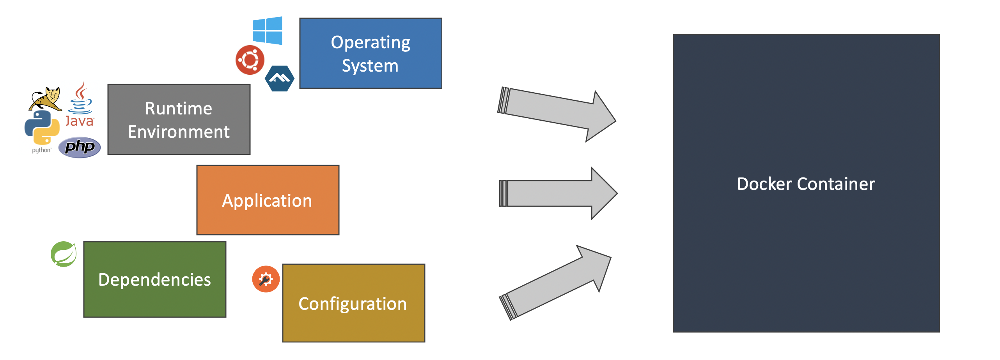]

---

# How is a Docker container created?

- By running a _Docker image_

  ```bash
  $ docker run \
      --rm \
      --name docker-container-demo \
      -p 8080:8080 \
      spkane/quantum-game:latest
  ```

  .conclusion[➤ We don't have to worry about any specific runtime environment or any particular dependency version as everything is encapsulated in the container]

[//]: # (Notes)
[//]: # (`--rm` [Clean up](https://docs.docker.com/engine/reference/run/#clean-up---rm)/deletes the container once the container stops))
[//]: # (`--name` [Name](https://docs.docker.com/engine/reference/run/#name---name) the container)
[//]: # (`-p` binds a port on the host to a port on the container)

[//]: # (We were able to start the Quantum Game application without having to worry about anything.  This Quantum Game application could have been written in Java, Node, or assembly for all we care.  All we need is to have the Docker image and the rest is handled by Docker.)

---


# What is a Docker image?

- A **read-only** filesystem that contains

  - operating system
  - programs needed by the application (e.g. Java Runtime Environment)
  - application executable, its dependencies, and configuration

- **Immutable** (cannot be modified once built)

.conclusion[➤ New image gets created **every time** a new version of our application is dockerized]

---

# Demo 2

Overview of `dive` (OS tool for exploring a docker image)

[//]: # (This is a good time to introduce dive, a tool for inspecting a docker image)
[//]: # (shows Docker image contents broken down by layer, we will show you later how to make use of it)

---

# How is a Docker image created?

- By building a _Dockerfile_ :

  ```bash
  $ docker build . -t boot-fat-jar:local
  ```

  The above command creates an image and tags it as `boot-fat-jar:local`

- We can run this Docker image, creating a Docker container when doing so, once this is built

  ```bash
  $ docker run \
       --rm \
       --name boot-fat-jar-demo \
       -p 8080:8080 \
       boot-fat-jar:local
  ```

[//]: # (Notes)
[//]: # (`--rm` [Clean up](https://docs.docker.com/engine/reference/run/#clean-up---rm)/deletes the container once the container stops))
[//]: # (`--name` [Name](https://docs.docker.com/engine/reference/run/#name---name) the container)
[//]: # (`-p` binds a port on the host to a port on the container)

---

# What is a Dockerfile?

A text file, usually named `Dockerfile`, that contains a set of instructions used to create the Docker image

[//]: # (Notes)
[//]: # (Docker promotes reuse and a _Dockerfile_ can extend another image => as we will show later with multi-stage docker files?)
[//]: # (For example, a _Dockerfile_ hosting a Java application can extend another image that already has the Java Runtime installed and only customises the parts that it needs, rather that starting from scratch)

---

# Example of a Dockerfile

Following is a typical _Dockerfile_ that hosts a Java 8 application:

  ```dockerfile
  FROM adoptopenjdk:8u262-b10-jre-hotspot
  WORKDIR /opt/app
  COPY ./build/libs/*.jar application.jar
  ENTRYPOINT ["java", "-jar", "application.jar"]
  ```

[//]: # (Notes)
[//]: # (Docker runs instructions in a Dockerfile in order.)
[//]: # (FROM: A Dockerfile must begin with a FROM instruction, whichspecifies the Parent Image from which you are building.)
[//]: # (WORKDIR: sets the working directory for the following command.)
[//]: # (COPY: copies the application jar file from the source and adds it to the filesystem of the container)
[//]: # (ENTRYPOINT: runs the Java application)

---

# Lifecycle

.responsive[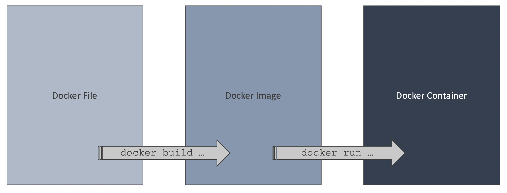]

[//]: # (Notes)
[//]: # (Here you can see the whole Docker lifecycle that we just walked through starting from the end.)
[//]: # (The instructions inside the Dockerfile build the Docker image which gets executed as a Docker container.)
[//]: # (For today's topic we will focus on the first two stages, Dockerfiles and images.)

---

class: impact

# Layers

[//]: # (This brings us to the topic of layers.)

---

# What are layers?

- Consider the following _Dockerfile_

  ```dockerfile
  FROM adoptopenjdk:8u262-b10-jre-hotspot
  WORKDIR /opt/app
  COPY ./build/libs/*.jar application.jar
  ENTRYPOINT ["java", "-jar", "application.jar"]
  ```

- The above Dockerfile has four layers:
  - `FROM ...`
  - `WORKDIR ...`
  - `COPY ...`
  - `ENTRYPOINT ...`

[//]: # (You already know this Dockerfile from a previous example.)
[//]: # (It has 4 layers, each starting with an instruction.)

---

# Intermediate Images

.responsive[]

[//]: # (Each executed instruction creates an intermediate layer or an intermediate image => same thing?)
[//]: # (every instruction afterwards builds on the previous layer)
[//]: # (Switch to Albert for Demo on hot wo build a Docker image)

---

# Demo 3

Build docker image and analyse layers with dive

- Build a docker image
- Discuss layers and see docker takes advantage of caching
- Analyse the docker image, using `dive`


---

# JAR file

 .jar (= java archive) is a package file format

[//]: # (Notes)
[//]: # (In the Demo you just saw a copy instruction involving a .jar file. JAR stands for Java archive and is a package file format. )

---

# FatJAR

- A very common way to package a JVM based application is a **FatJAR**

- A FatJAR contains
  - The application
  - All its dependencies

- A FatJAR is standalone and can be executed like this:

  ```bash
  $ java -jar application.jar
  ```

---

# FatJAR in a Docker image

- The FatJAR is copied from our laptop into the Docker image using the `COPY` instruction:

  ```dockerfile
  COPY ./build/libs/*.jar application.jar
  ```

- This creates a new layer every time a new FatJAR file is created, e.g. every time the code changes

- Creating many large layers may consume large amounts of disk space

[//]: # (Notes)
[//]: # (As you can see in the next image)

---

# Size of FatJAR

.responsive[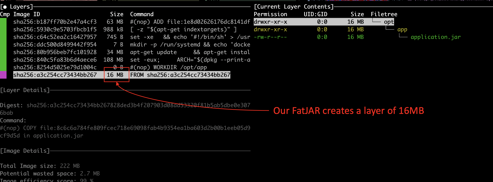]

---

# Space requirements

- Consider a team working 5 days a week and committing 20 times per day

- Each commit is followed by a push, which triggers an automated build pipeline, which builds the application and **creates a new docker image**

.responsive[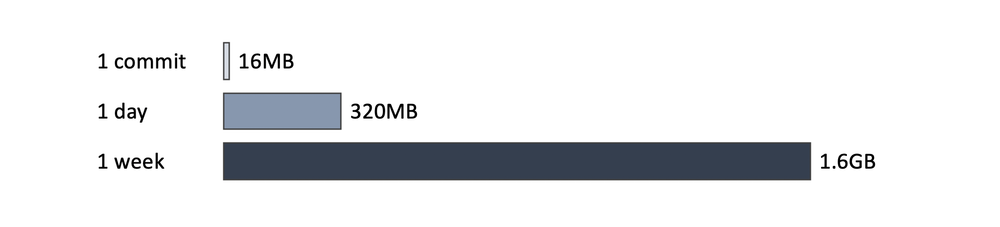]

[//]: # (Notes)
[//]: # (Deleting older images is not a trivial task and requires some thought because they might be needed for rollbacks or legal/auditing purposes)

---

# The challenge

- Our application (FatJAR) contains our code **and** its dependencies

- When new features are added, the dependencies are not necessarily updated

  .conclusion[However: each small change in the code, creates a new docker layer of about 16MB in size]

---

# The challenge - Version 1

.responsive[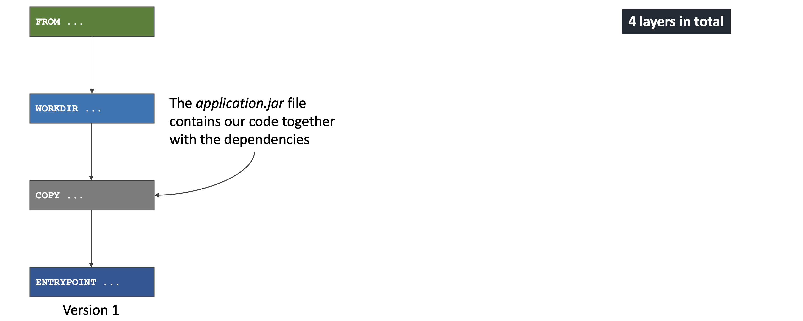]

[//]: # (Notes)
[//]: # (What does this mean in detail? We will visiluaze what happens every time the code changes.)

---

# The challenge - Version 2

.responsive[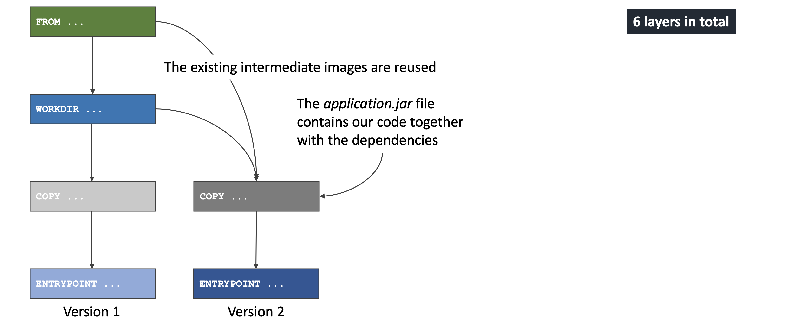]

[//]: # (Notes)
[//]: # (Even though Docker uses caching as shown in demo 3 and re-uses the first two layers )
[//]: # (every time the app code changes, two new layers are built, one of them containing the whole fatjar)

---

# The challenge - Version 3

.responsive[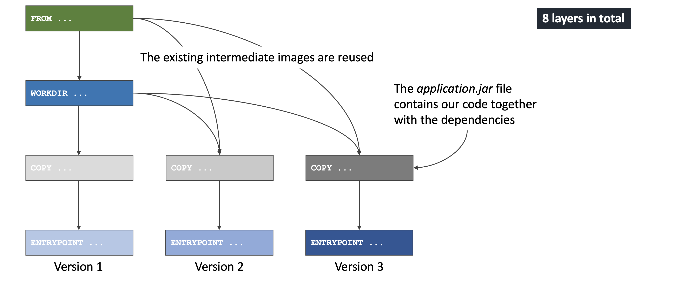]

[//]: # (Notes)
[//]: # (And as you can see, this adds up with every code commit, here we already have 8 layers)

---

# The challenge - Version 4

.responsive[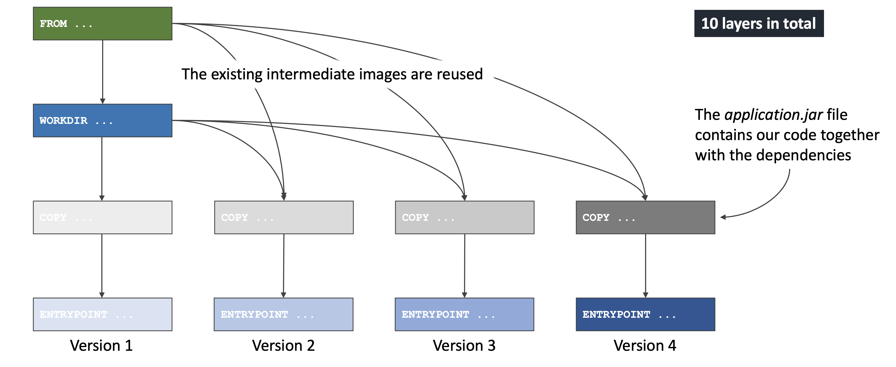]

[//]: # (Notes)
[//]: # (ending up with 10 layers for 4 code changes)

---

# Solution: Splitting the FatJAR

- Given that some parts of the FatJAR, the dependencies, change less frequently but take up a lot of space

  .conclusion[➤ Solution: Splitting the dependencies from the code by creating a new layer and taking advantage of caching]


---

# Splitting the FatJAR - Version 1

.responsive[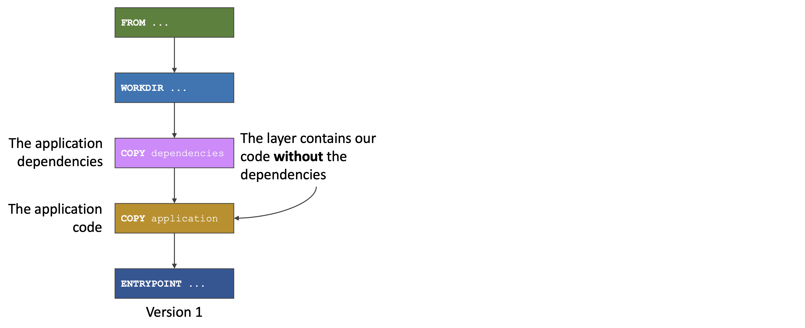]

[//]: # (Notes)
[//]: # (How will this work in detail?)
[//]: # (We will have one extra `COPY` instruction or layer, with our application getting copied after the dependencies)


---

# Splitting the FatJAR - Version 2

.responsive[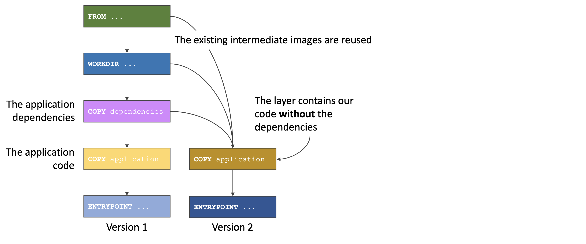]

[//]: # (Notes)
[//]: # (Here you can see that the dependencies from now on are getting cached, )
[//]: # (while the application layer contains our code without the dependecides)


---

# Splitting the FatJAR - Version 3

.responsive[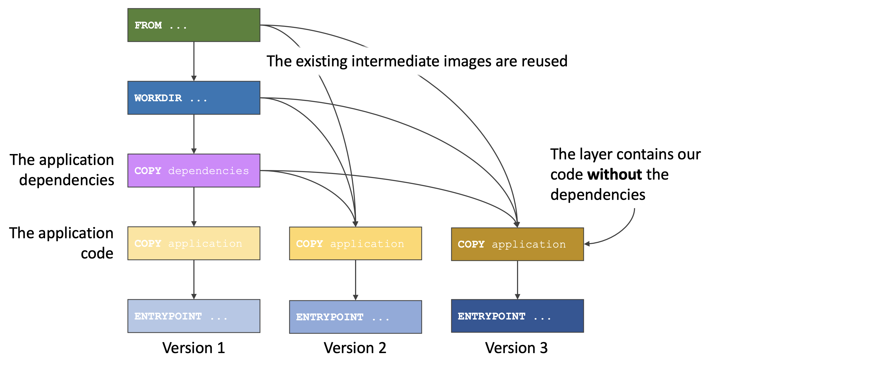]

---

# Splitting the FatJAR - Version 4

.responsive[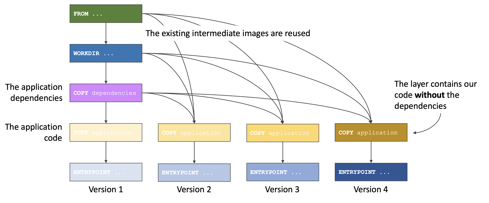]

[//]: # (So changes to our application will require a much thinner layer to be created)

---

class: impact

# Spring Boot

---

# Spring Boot

Spring Boot is a very popular framework that promotes productivity

.responsive[]
[https://spring.io/projects/spring-boot](https://spring.io/projects/spring-boot)

---

# Layered JAR

- Spring Boot 2.3 comes with a new feature, _Layered JAR_

- This can be enabled by simply adding a configuration to the Gradle `build.gradle` file

  ```groovy
  bootJar {
      layered()
  }
  ```

  An equivalent plugin is available for Maven too

- Spring Boot 2.4 will have _Layered JAR_ enabled by default

---

# How does this work?

- Build the Layered JAR (using _Gradle_)

- Extract the Layered JAR (using _layertool_)

- Run the Extracted JAR (using _JarLauncher_)

.responsive[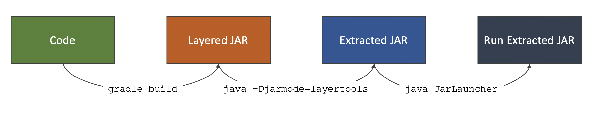]

---

# Demo 4

Build layered JAR, extract it and run extracted JAR

- Build layered JAR
- Extract Layered JAR
- Run Extracted JAR

---

# How does this work with docker?

- We can take advantage of multistage docker builds

  ```dockerfile
  FROM adoptopenjdk:8u262-b10-jre-hotspot as builder
  WORKDIR /opt/app
  COPY ./build/libs/*.jar application.jar
  RUN java -Djarmode=layertools -jar application.jar extract

  FROM adoptopenjdk:8u262-b10-jre-hotspot
  WORKDIR /opt/app
  COPY --from=builder /opt/app/dependencies ./
  COPY --from=builder /opt/app/spring-boot-loader ./
  COPY --from=builder /opt/app/snapshot-dependencies ./
  COPY --from=builder /opt/app/application ./
  ENTRYPOINT ["java", "org.springframework.boot.loader.JarLauncher"]
  ```

---

# Builder stage

- Copy the layered JAR created by Gradle

  ```Dockerfile
  FROM adoptopenjdk:8u262-b10-jre-hotspot as builder
  WORKDIR /opt/app
  COPY ./build/libs/*.jar application.jar
  ```

- Extract the layered JAR

  ```Dockerfile
  RUN java -Djarmode=layertools -jar application.jar extract
  ```

  This command will create four folders in the builder stage, which we will copy in the final stage

---

# Final stage

- Starts with a Java image

  ```Dockerfile
  FROM adoptopenjdk:8u262-b10-jre-hotspot
  WORKDIR /opt/app
  ```

- Copy the extracted folders from the builder stage

  ```Dockerfile
  COPY --from=builder /opt/app/dependencies ./
  COPY --from=builder /opt/app/spring-boot-loader ./
  COPY --from=builder /opt/app/snapshot-dependencies ./
  COPY --from=builder /opt/app/application ./
  ```

- Run the application using `JarLauncher`

  ```Dockerfile
  ENTRYPOINT ["java", "org.springframework.boot.loader.JarLauncher"]
  ```

---

# Demo 5

Create docker image using layered JAR and analyse it with dive

- Create docker image (using multistage and layered JAR)
- Inspect with Dive

---

# Size of Layered JAR

.responsive[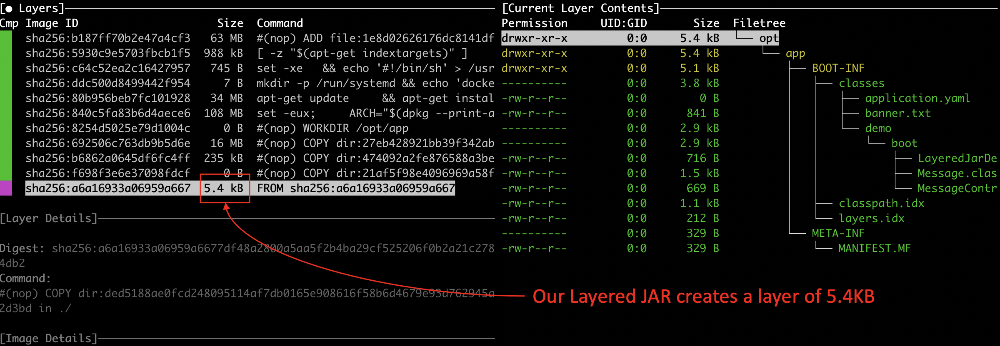]

---

# Comparison

- Comparing these two approaches we will find that a layered JAR is far more efficient than a FatJAR in terms of disk space

.responsive[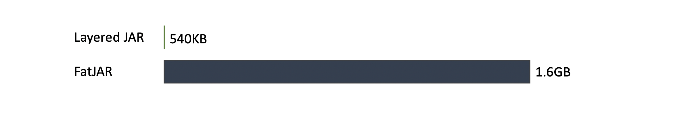]

---
class: impact

# Beyond Spring Boot

---

# Micronaut

Micronaut is reflection free alternative framework to Spring Boot

.responsive[]
[https://micronaut.io/](https://micronaut.io/)

---

# Lack of tooling

- Spring Boot provides the layered JAR functionality as a Gradle task

- This is not available for all other frameworks

- We can still take advantage of the docker multistage to split our dependencies from the application manually

---

# How will this work?

- Extract the distribution ZIP file<br/>
  _generated by the `distribution` Gradle plugin which is applied by the `application` Gradle plugin_

- Move our application thin JAR to its own directory

- Update the run script

.responsive[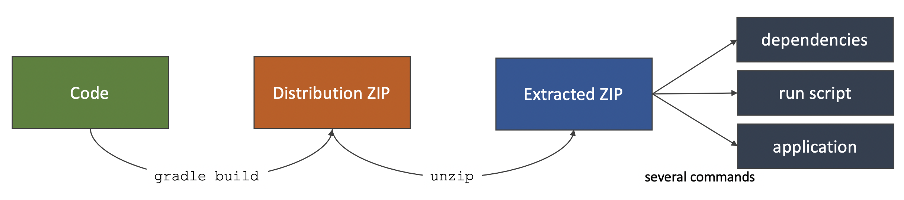]

---

# Multistage to the rescue

```Dockerfile
FROM alpine:3.12.0 as builder
WORKDIR /opt/app
COPY ./build/distributions/*.zip application.zip
RUN unzip application.zip && rm application.zip \
    && mv * dist && rm dist/bin/*.bat && mv dist/bin/* dist/bin/run.original \
    && sed 's|$APP_HOME/lib/application.jar|$APP_HOME/app/application.jar|g' dist/bin/run.original > dist/bin/run \
    && chmod +x dist/bin/run \
    && rm dist/bin/run.original \
    && mkdir dist/app \
    && mv dist/lib/application.jar dist/app/application.jar

FROM adoptopenjdk:8u262-b10-jre-hotspot
ENV APP_HOME /opt/app
WORKDIR ${APP_HOME}
COPY --from=builder /opt/app/dist/lib lib/
COPY --from=builder /opt/app/dist/bin bin/
COPY --from=builder /opt/app/dist/app app/
ENTRYPOINT ["./bin/run"]
```

---

# Demo 6

Create docker image using distribution ZIP and analyse it with dive

- Go through the `micronaut-layered-jar-1.0.zip` file
- Go through the multistage docker file
- Create docker image (using multistage)
- Inspect with Dive

---

# Comparison

.responsive[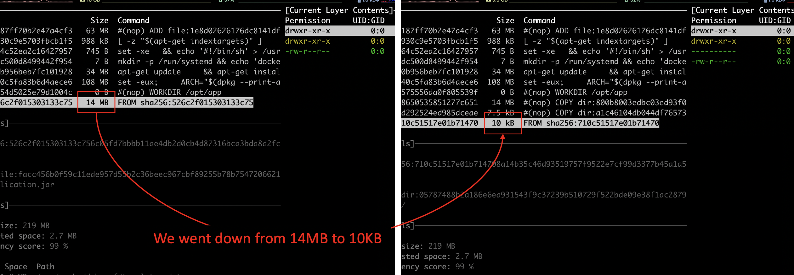]

---

class: impact

# Thank You

## Feedback makes us better

Please send any feedback to: albert.attard@thoughtworks.com or jlang@thoughtworks.com

---

class: careers
