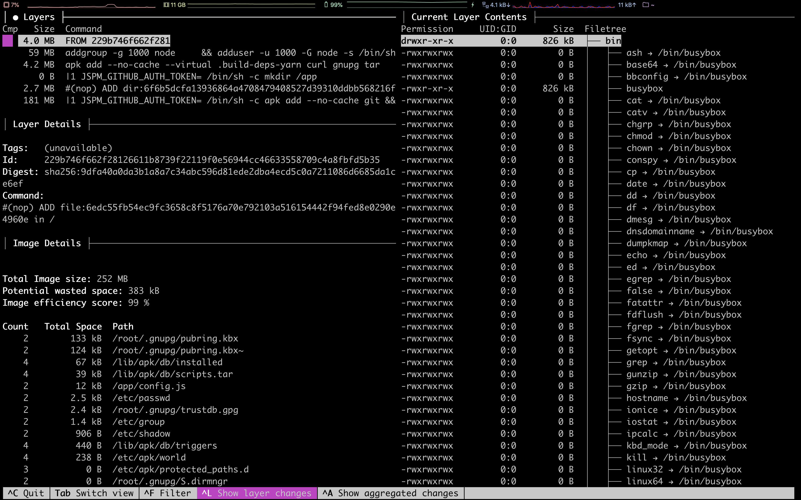
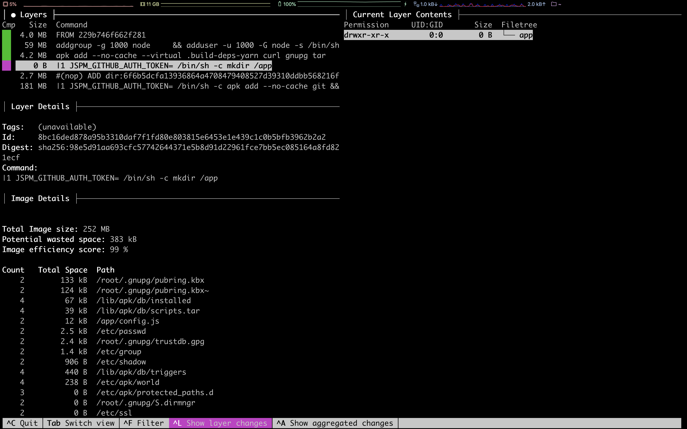

# Demo 2

Analyse a Docker image


1. Verify that [`dive`](https://github.com/wagoodman/dive) is installed

   ```bash
   $ dive --version
   ```

   `dive`'s version is printed if it is installed.

   ```bash
   dive 0.9.2
   ```

   The version may vary.

   `dive` can be installed using `brew`.

   ```bash
   $ brew install dive
   ```

1. Investigate with dive

   ```bash
   $ dive spkane/quantum-game:latest
   ```

   Dive will download the image

   ```bash
   Image Source: docker://spkane/quantum-game:latest
   Fetching image... (this can take a while for large images)
   Analyzing image...
   Building cache...
   ```

   

   
