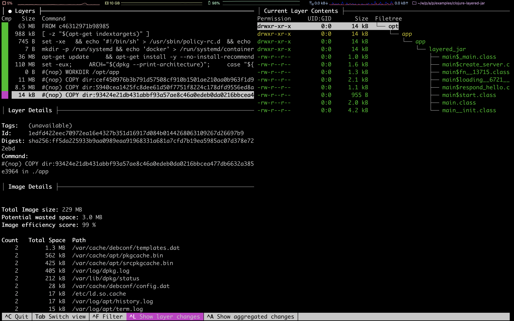

# Demo 7

Create Clojure layered JAR Docker image using Badigeon and analyse it with dive

1. Go to example

   ```bash
   $ cd clojure-layered-jar
   ```

1. Build the project

   ```bash
   $ rm -rf .cpcache && rm -rf target
   $ clojure -A:build -m package
   ```

1. Navigate to the `target` directory

   ```bash
   $ cd target
   ```

   List the directory's content

   ```bash
   $ ls -l
   ```

   This should contain two folders

   ```bash
   drwxr-xr-x  10 albertattard  staff  320 Apr 27 12:34 classes
   drwxr-xr-x   4 albertattard  staff  128 Apr 27 12:34 lib
   ```

1. Navigate to the `classes` directory

   ```bash
   $ cd classes
   ```

   List the directory's content

   ```bash
   $ ls -l
   ```

   This will contain all Clojure compiled code, including our application

   ```bash
   total 0
   drwxr-xr-x  136 albertattard  staff  4352 Apr 27 12:34 cheshire
   drwxr-xr-x  303 albertattard  staff  9696 Apr 27 12:34 clj_time
   drwxr-xr-x    5 albertattard  staff   160 Apr 27 12:34 clojure
   drwxr-xr-x   68 albertattard  staff  2176 Apr 27 12:34 cognitect
   drwxr-xr-x   14 albertattard  staff   448 Apr 27 12:34 crypto
   drwxr-xr-x    3 albertattard  staff    96 Apr 27 12:34 io
   drwxr-xr-x   10 albertattard  staff   320 Apr 27 12:34 layered_jar
   drwxr-xr-x    4 albertattard  staff   128 Apr 27 12:34 ring
   ```

1. Run the application

   ```bash
   $ cd ..
   $ java -cp "classes:lib/lib/*" layered_jar.main
   ```

   Stop the application

1. Move the application to its own directory

   ```bash
   $ mkdir app
   $ mv classes/layered_jar app/layered_jar
   ```

   This is required as we like to separate the application from its dependencies

1. Run the application

   ```bash
   $ java -cp "app:classes:lib/lib/*" layered_jar.main
   ```

   Stop the application

1. Analyse the `Dockerfile`

   ```bash
   $ cd ..
   $ vi Dockerfile
   ```

   The `Dockerfile` contains the following instructions

   ```dockerfile
   FROM clojure:openjdk-8-tools-deps-1.10.1.561-slim-buster AS builder
   WORKDIR /opt/app
   COPY deps.edn ./deps.edn
   COPY ./build_src ./build_src
   COPY ./src ./src
   RUN clojure -A:build -m package
   RUN mkdir ./target/app && mv ./target/classes/layered_jar ./target/app/layered_jar

	 FROM adoptopenjdk:8u262-b10-jre-hotspot
   WORKDIR /opt/app
   COPY --from=builder /opt/app/target/lib/lib ./lib
   COPY --from=builder /opt/app/target/classes ./classes
   COPY --from=builder /opt/app/target/app ./app
   ENTRYPOINT ["java", "-cp", "app:classes:lib/*", "layered_jar.main"]
   ```

1. Build the Docker image

   ```bash
   $ docker build . -t clojure-layered-jar:local
   ```

1. Investigate the Docker image using `dive`

   ```bash
   $ dive clojure-layered-jar:local
   ```

   
